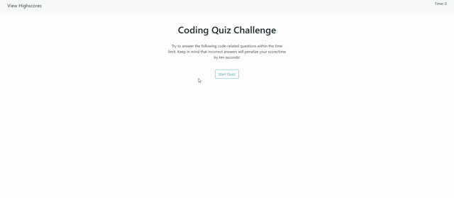

# Javascript Quiz

[Click here to check out the webiste!](https://cldominy.github.io/javascript-quiz/ "Javascript Quiz")

This website was built from scratch using Javascript and Bootstrap. It was designed to learn how to utlize Web APIs while also refreshing a user by creating a Javascript related quiz. Each time a user completes the timed quiz, they are given the option of saving their final score (time remaing) and then viewing the high scores on their local storage.

# Preview of the Website

I created this website for simplicity, so the user can focus on reading each question and navigating between the two pages.

